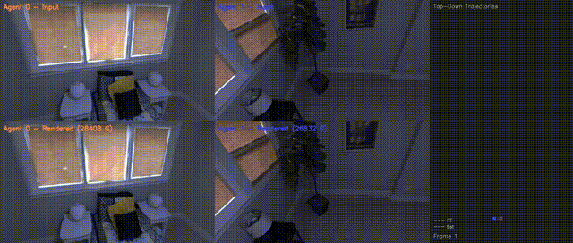
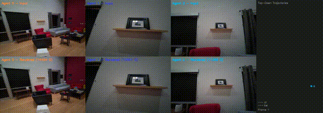
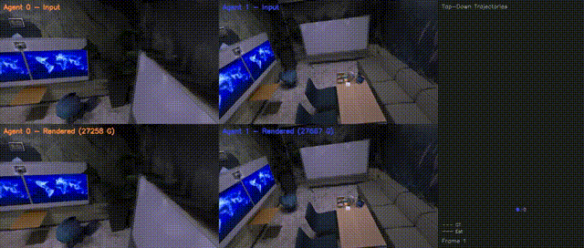

# DUAG-C: Decentralized Uncertainty-Aware Gaussian Consensus for Multi-Robot Dense Mapping

**DUAG-C** is the first decentralized multi-agent consensus algorithm that enables dense 3D Gaussian Splatting (3DGS) map merging across robots without a central server. Each robot independently builds a local 3DGS map using RGB-D input and collaboratively fuses maps with neighbors through a novel Riemannian ADMM optimizer weighted by Fisher Information (FIM) uncertainty estimates. DUAG-C is the core consensus contribution of the larger DUAG-SLAM project.

## Demo Videos

### Replica Apart-0 (2 agents, N frames)

<p align="center">
  
</p>

### Aria Room-0 (2 agents, N frames)

<p align="center">
  
</p>

### Replica Office-0 (2 agents, N frames)

<p align="center">
  
</p>

Each video shows side-by-side rendered views from both agents as they independently explore the scene, building and refining their 3DGS maps in real time.

> **Note:** These videos were produced at an earlier commit. To reproduce the exact results, checkout commit `7a42c0e` (0.00060m) or the corresponding tag.

---

## Project Structure

```
DUAG-SLAM/
├── core/                 ← All novel code
│   ├── types.py                  Data structures (GaussianMap, PoseGraph, etc.)
│   ├── uncertainty/              FIM-based epistemic uncertainty (Sub-c 1.1)
│   ├── consensus/                DUAG-C optimizer: Lie algebra, ADMM, matching (Sub-c 1.2–1.3)
│   ├── pipeline/                 RobotNode orchestration + LocalSLAMWrapper
│   └── visualization/            Real-time OpenCV viewer
│
├── extracted/            ← Thin adapters from reference repos
│   ├── gs_slam/                  MonoGS Gaussian model, renderer, camera utils
│   ├── dpgo_wrapper/             DPGO C++ pybind11 bridge
│   └── swarm_comm/               Simulated communication channel
│
├── experiments/          ← Experiment runners and configs
│   ├── run_duag_c.py             Main experiment runner
│   ├── configs/                  YAML configs per scene/dataset
│   └── data_loaders.py           Dataset loading (Replica, Aria, S3E, Kimera)
│
├── repos/                ← 5 reference codebases (READ-ONLY)
│   ├── MonoGS/                   Monocular 3DGS SLAM (CVPR 2024)
│   ├── MAC-Ego3D/                Centralized multi-agent 3DGS SLAM
│   ├── dpgo/                     Distributed pose graph optimization (C++)
│   ├── Swarm-SLAM/               Decentralized sparse SLAM (ROS 2)
│   └── MAGiC-SLAM/               Centralized multi-agent GS SLAM (baseline)
│
├── data/                 ← Datasets
│   ├── ReplicaMultiagent/        Synthetic indoor (2 agents)
│   ├── AriaMultiagent/           Real indoor — Project Aria glasses (3 agents)
│   ├── s3e/                      Real outdoor — 3 UGVs (18 sequences)
│   └── kimera_campus/            Real outdoor — 6 robots, campus
│
├── outputs/              ← Results, trajectories, renders, videos
├── tests/                ← Unit tests for all core modules
├── scripts/              ← Extraction, download, and analysis scripts
└── Figure/               ← Paper figures (PDF + PNG)
```

---

## Quick Start

### Prerequisites

- NVIDIA GPU with CUDA 11.8+
- Conda (Miniconda or Anaconda)
- ~20 GB disk space for datasets

### Installation

```bash
# 1. Clone
git clone <your-repo-url> DUAG-SLAM && cd DUAG-SLAM

# 2. Setup (clones reference repos into /repos and compiles CUDA rasterizer)
chmod +x setup.sh && ./setup.sh

# 3. Create environment
conda activate duag
pip install -r requirements.txt

# 4. Extract components from reference repos
python scripts/extract_monogs.py
```

### Run Tests

```bash
conda activate duag
python -m pytest tests/ -v
```

### Run an Experiment

All commands assume you are in the project root with the `duag` conda environment activated:

```bash
conda activate duag

# Replica Apart-0 — 100 frames, 2 agents (quick test)
PYTHONPATH="" python experiments/run_duag_c.py \
    --config experiments/configs/replica_apart0_quick.yaml

# With real-time visualization
PYTHONPATH="" python experiments/run_duag_c.py \
    --config experiments/configs/replica_apart0_quick.yaml --viz

# Replica Office-0 — 200 frames
PYTHONPATH="" python experiments/run_duag_c.py \
    --config experiments/configs/replica_office0_quick.yaml --viz

# Full 2500-frame run
PYTHONPATH="" python experiments/run_duag_c.py \
    --config experiments/configs/replica_apart0.yaml
```

### Available Configs

| Config                          | Dataset | Scene       | Frames | Agents |
| ------------------------------- | ------- | ----------- | ------ | ------ |
| `replica_apart0_quick.yaml`     | Replica | Apart-0     | 2500   | 2      |
| `replica_apart0.yaml`           | Replica | Apart-0     | 2500   | 2      |
| `replica_apart1.yaml`           | Replica | Apart-1     | 2500   | 2      |
| `replica_apart2.yaml`           | Replica | Apart-2     | 2500   | 2      |
| `replica_office0_quick.yaml`    | Replica | Office-0    | 1500   | 2      |
| `replica_office0.yaml`          | Replica | Office-0    | 2500   | 2      |
| `aria_multiagent_duag_c.yaml`   | Aria    | Multi-room  | full   | 3      |
| `s3e_duag_c.yaml`               | S3E     | Outdoor     | full   | 3      |
| `kimera_campus_duag_c.yaml`     | Kimera  | Campus      | full   | 6      |
| `ablation_uniform_weights.yaml` | Replica | Multi-scene | full   | 2      |

### Outputs

Results are saved to `outputs/`:

- `outputs/results/<experiment>.json` — metrics (ATE, PSNR, SSIM, LPIPS, ECE)
- `outputs/trajectories/` — estimated and GT trajectories (TUM format)
- `outputs/renders/` — rendered images per agent
- `outputs/videos/` — per-agent and combined visualization videos

### Generate Paper Figures

```bash
python experiments/analyze_results.py

```

---

## How It Works

1. **Local SLAM**: Each robot runs MonoGS independently, building a local 3DGS map from RGB-D input
2. **FIM Uncertainty**: Per-Gaussian Fisher Information is accumulated over keyframes — high FIM = confident, low FIM = uncertain
3. **Loop Closure Detection**: Inter-agent loop closures trigger the consensus pipeline
4. **DUAG-C Consensus**: Riemannian ADMM optimizes relative poses between robots; matched Gaussians are fused using FIM-weighted averaging (confident Gaussians dominate the merge)
5. **Map Fusion**: Transformed neighbor maps are merged into the local map with uncertainty-aware pruning

---

## Datasets

| Dataset             | Type                       | Agents | Scenes                      | Download                           |
| ------------------- | -------------------------- | ------ | --------------------------- | ---------------------------------- |
| Replica-Multiagent  | Synthetic indoor           | 2      | 5 (Apart-0/1/2, Office-0/2) | `bash scripts/download_replica.sh` |
| Aria-Multiagent     | Real indoor (Aria glasses) | 3      | 3                           | `bash scripts/download_aria.sh`    |
| S3E                 | Real outdoor (3 UGVs)      | 3      | 18                          | `bash scripts/download_s3e.sh`     |
| Kimera-Multi Campus | Real outdoor (campus)      | 6      | 2                           | `bash scripts/download_kimera.sh`  |

---
